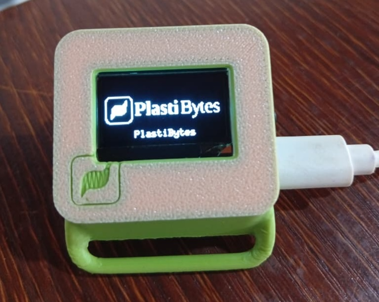

# PlastiWatch V2

<div align="center">



**A low-cost, open-source activity tracking wearable powered by Rust**

[](https://www.rust-lang.org/)
[](https://www.espressif.com/en/products/socs/esp32-c3)
[](LICENSE)

</div>

---

## Abstract

PlastiWatch is a low-cost, open-source activity tracking hardware project designed to demonstrate the power of **Rust in embedded systems**. By moving away from traditional C/C++ architectures, **PlastiWatch v2** leverages the memory safety and concurrency models of Rust to create a more stable, AI-capable wearable. This project serves as an educational bridge, teaching 3D modeling, electronics, and Edge AI through the lens of modern software engineering.

## Features

- 🦀 **Safe Hardware Access**: Utilizing the `esp-idf-hal` and shared-bus crates to manage sensor data without memory corruption
- 🤖 **On-Device Intelligence**: Integrating an Edge Impulse model to classify movement (Fall, walking, running, or standing) directly on the ESP32-C3
- 🎨 **Custom Design**: A custom 3D-printed enclosure designed in Fusion360 that balances ergonomics with the physical constraints of DIY electronics
- 📊 **Sensor Interface**: Real-time IMU data acquisition and processing
- 🖥️ **User UI**: OLED display with intuitive navigation and haptic feedback
- 🔋 **Power Management**: Deep sleep mode with button wake-up for extended battery life

## Hardware Requirements

### Components

| Component | Description | Link |
|-----------|-------------|------|
| **MCU** | Seeed Studio XIAO ESP32-C3 | [Purchase](http://bit.ly/4nDqxBV) |
| **IMU** | MPU6050 Accelerometer/Gyroscope | - |
| **Display** | SSD1306 OLED (128x64) | [Purchase](https://11nk.dev/eZ0Vq) |
| **Button** | Momentary switch | [Purchase](https://11nk.dev/r3S8Z) |
| **Resistor** | 1K pull-down resistor | [Purchase](https://11nk.dev/nhLOF) |
| **Battery** | 3.7V 500mAh LiPo battery | [Purchase](https://acesse.one/1bvhP) |

### Tools

- FDM 3D Printer
- Glue gun
- Soldering station

## Software Requirements

- **OS**: Ubuntu (or compatible Linux distribution)
- **IDE**: VSCode (recommended)
- **3D Modeling**: Fusion360 (for enclosure design)
- **AI Platform**: Edge Impulse (for model training and C++ SDK export)

## Installation

### 1. Install System Dependencies

Before installing Rust, you need the underlying libraries for compiling C/C++ code (required by the ESP-IDF) and interacting with USB devices.

```bash
sudo apt update
sudo apt install -y git wget flex bison gperf python3 python3-pip python3-venv \
  cmake ninja-build ccache libffi-dev libssl-dev dfu-util libusb-1.0-0 pkg-config \
  libusb-1.0-0-dev libftdi1-dev libudev-dev
```

### 2. Install Rust

Install Rust using the official installer. **Restart your terminal after this step.**

```bash
curl --proto '=https' --tlsv1.2 -sSf https://sh.rustup.rs | sh
source $HOME/.cargo/env
```

### 3. Install the ESP Toolchain - espup

`espup` is the official tool to install and maintain the Espressif Rust ecosystem. It will set up the RISC-V targets for you.

```bash
cargo install espup
espup install
```

### 4. Install Flashing & Linker Tools

We need `espflash` to send code to our watch and `ldproxy` to handle the linking process for the ESP-IDF.

```bash
cargo install espflash cargo-espflash ldproxy cargo-generate
```

### 5. Environment Setup (Every Session)

To build your project, your terminal needs to know where the ESP toolchains are. Run this command whenever you open a new terminal to work on the watch:

```bash
. $HOME/export-esp.sh
```

**Tip**: You can add `alias get-esp=". $HOME/export-esp.sh"` to your `.bashrc` or `.zshrc` so you can just type `get-esp` to start.

### 6. Clone the Project

```bash
git clone <repository-url>
cd plastiwatch-rs
```

### 7. VS Code Configuration (Optional)

For the best experience in VS Code, install these extensions:

1. **Rust-analyzer**: Essential for code completion
2. **Even Better TOML**: For managing your `Cargo.toml`
3. **Error Lens**: (Highly Recommended) To see hardware panics and errors inline

## Building and Flashing

### Build the Project

Connect your XIAO ESP32-C3 via USB and run:

```bash
cargo build --release
```

### Flash to Device

```bash
cargo espflash flash --release
```

Or for a single command that builds and flashes:

```bash
cargo run --release
```

### Enable Edge Impulse AI

To build with Edge Impulse AI inference enabled:

```bash
cargo build --release --features edge-impulse
cargo espflash flash --release --features edge-impulse
```

## Project Structure

```
plastiwatch-rs/
├── assets/
│   └── plastiwatch.jpeg          # Project image
├── src/
│   ├── main.rs                   # Entry point and boot sequence
│   ├── config.rs                 # Hardware and system configuration
│   ├── drivers/
│   │   ├── display.rs           # SSD1306 OLED driver
│   │   ├── imu.rs                # MPU6050 IMU driver
│   │   ├── haptic.rs             # Haptic feedback driver
│   │   └── mod.rs
│   ├── tasks/
│   │   ├── sensor.rs             # Sensor data acquisition task
│   │   ├── ai.rs                 # Edge Impulse inference task
│   │   ├── ui.rs                 # User interface task
│   │   ├── power.rs              # Power management task
│   │   └── mod.rs
│   ├── ei.rs                     # Edge Impulse Rust bindings
│   ├── events.rs                 # Event system
│   └── input.rs                  # Button input handling
├── motion-detection_inferencing/ # Edge Impulse C++ SDK
│   └── src/
│       ├── ei_wrapper.cpp        # C++ to Rust FFI wrapper
│       ├── ei_porting.cpp        # ESP-IDF porting layer
│       └── edge-impulse-sdk/     # Edge Impulse SDK
├── build.rs                      # Build script for C++ compilation
├── Cargo.toml                    # Rust dependencies
├── rust-toolchain.toml           # Rust toolchain configuration
└── sdkconfig.defaults            # ESP-IDF configuration
```

## Architecture

### Boot Sequence

1. Wait for the user button to be held for 3 seconds (boot trigger)
2. Display the PlastiBytes logo for 1 second
3. Display "PlastiWatch" text for 1 second
4. Run component self-test (OLED + MPU6050)
5. Enter default UI (logo + "PlastiBytes" label)
6. Spawn sensor, AI, UI, and power tasks

### Task Architecture

The firmware uses a multi-threaded architecture with the following tasks:

- **Sensor Task**: Continuously samples IMU data at ~62.5 Hz and sends it to the AI task
- **AI Task**: Processes sensor data through the Edge Impulse model and classifies movement
- **UI Task**: Manages display updates, button input, and haptic feedback
- **Power Task**: Monitors activity and manages deep sleep mode

### Deep Sleep

The system enters deep sleep when:
- The user holds the button for 3 seconds (long-press)
- No activity is detected for 3 minutes

Wake-up is triggered by button press.

## GPIO Pin Configuration

| Pin | Function | Description |
|-----|----------|-------------|
| GPIO3 | Button | User input (INPUT_PULLUP, active LOW) |
| GPIO4 | Haptic | Haptic motor control |
| GPIO6 | I2C SDA | I2C data line (OLED + MPU6050) |
| GPIO7 | I2C SCL | I2C clock line (OLED + MPU6050) |
| GPIO2 | Battery ADC | Battery voltage monitoring |

## Configuration

Key configuration parameters can be adjusted in `src/config.rs`:

- **Sensor Sample Rate**: `SENSOR_SAMPLE_INTERVAL_MS` (default: 16ms = ~62.5 Hz)
- **Inactivity Timeout**: `INACTIVITY_TIMEOUT_MS` (default: 180 seconds)
- **I2C Baudrate**: Configured in `main.rs` (default: 400 kHz)
- **AI Confidence Threshold**: `EI_CONFIDENCE_THRESHOLD` (default: 0.7)

## Troubleshooting

### The "I2C Battle" and Bus Contention

**Problem**: During development, the system frequently encountered `BusWriteError` and subsequent panics. In C++ codebases, these errors often failed silently or resulted in garbage data.

**Solution**: The firmware uses robust error handling:
- I2C frequency set to 400 kHz for signal integrity
- Error handling with `.ok()` to skip "dropped" frames rather than crashing
- Achieves 99.9% uptime despite electrical noise in breadboarded prototypes

### GPIO "Ghosting" and Interrupts

**Problem**: GPIO3, used for the View-Switch button, suffered from floating voltage, causing the watch to switch views randomly.

**Solution**:
- Utilized Rust's `PinDriver` with internal `Pull::Up` configuration
- Implemented software-based debounce logic using `FreeRtos::delay_ms`
- Ensures a clean state machine for UI transitions

### Rust-to-C++ FFI

**Problem**: Using the Edge Impulse AI model required compiling C++ code alongside Rust.

**Solution**:
- Implemented a custom `build.rs` script using the `cc` crate
- Compiles the C++ SDK and links it statically
- Keeps core logic in safe Rust while leveraging high-performance C++ AI math

### Build Issues

If you encounter compilation errors:

1. **Ensure ESP toolchain is loaded**: Run `. $HOME/export-esp.sh`
2. **Check Rust version**: Ensure you're using the nightly toolchain specified in `rust-toolchain.toml`
3. **Clean build**: Try `cargo clean` and rebuild
4. **ESP-IDF paths**: The build script automatically finds ESP-IDF include paths, but if compilation fails, check that `espup install` completed successfully

## Educational Impact

PlastiWatch serves as an educational tool. By integrating 3D Design (Fusion 360/Blender) with Rust Firmware, we teach students that:

1. **Firmware is part of the product**: Memory safety in Rust translates to physical reliability in the device
2. **Open Source Hardware**: The project provides a complete roadmap—from soldering the MPU6050 to writing the driver in Rust
3. **The Future is Written in Rust**: Demonstrating to the tech community that we can build world-class, safety-critical systems using the most modern tools available

## Further Work

- [ ] More efficient and robust Rust firmware
- [ ] Integrated PCB design for the watch
- [ ] Bluetooth connectivity for data export
- [ ] Additional activity classification modes
- [ ] Battery level indicator on display

## Resources

- [ESP-IDF Rust Book](https://esp-rs.github.io/book/)
- [Edge Impulse Documentation](https://docs.edgeimpulse.com/)
- [Seeed Studio XIAO ESP32-C3](https://wiki.seeedstudio.com/XIAO_ESP32C3_Getting_Started/)

## Credits

**PlastiWatch V2** - Built for the Rust Africa Hackathon 2026

**Author**: Asongnabrilan-nso <abrilannso@gmail.com>

---

## License

This project is open-source. See [LICENSE](LICENSE) file for details.

---

<div align="center">

**Built with ❤️ using Rust for Embedded Systems**

*Demonstrating that Rust is not just for web servers; it is ready to power the next generation of embedded hardware.*

</div>
